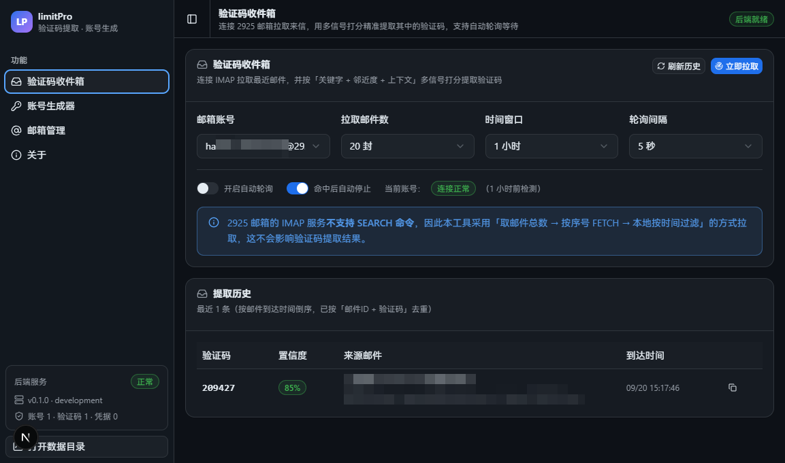
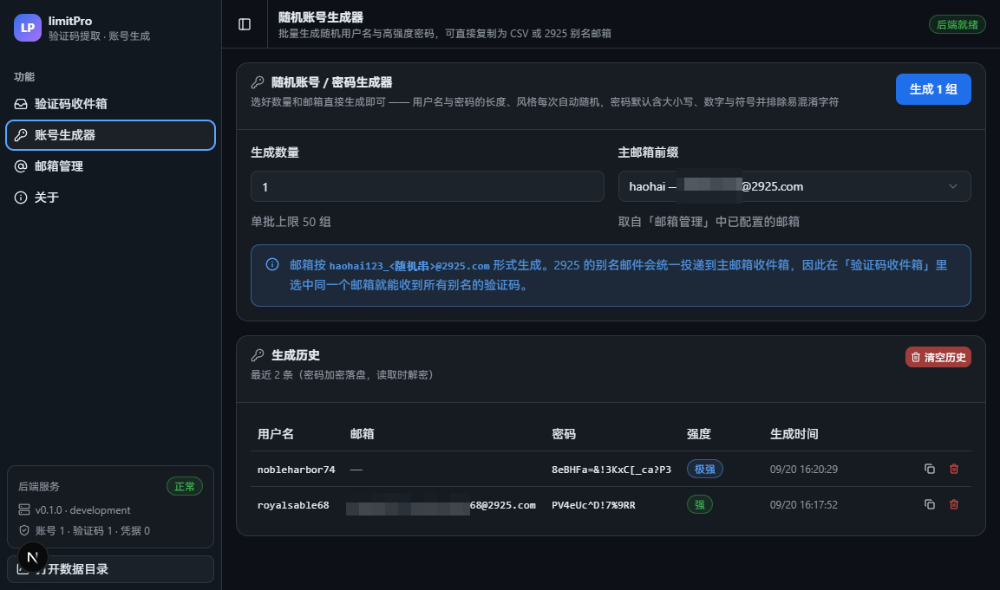
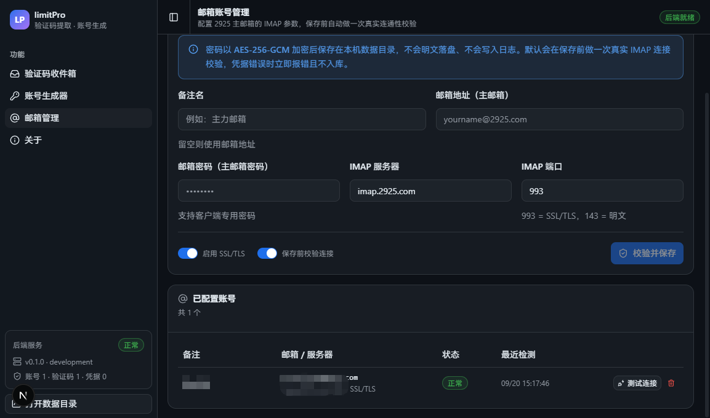

<div align="center">

# limitPro

**把 2925 邮箱的验证码挑出来 · 顺手生成一批账号密码**

完全跑在你自己电脑上的小工具 —— 不用登录网页邮箱，数据也不上传到任何地方


[界面预览](#界面预览) · [快速开始](#快速开始) · [怎么用](#怎么用) · [常见问题](#常见问题)

</div>

---

## 它能帮你做什么

注册各种账号时，最烦的其实是两件小事：

1. **等验证码** —— 得切到邮箱网页，翻半天，还得从一堆广告邮件里把 6 位数字找出来；
2. **起账号密码** —— 长度、大小写、符号都要合规，还得一个个记下来。

limitPro 就是把这两件事变成点一下按钮。它长这样：

## 📸 界面预览



| 账号生成器 | 邮箱管理 |
| :---: | :---: |
|  |  |

---

## ✨ 三个功能

### 📨 验证码收件箱

- 点「立即拉取」，它自己去邮箱里把验证码找出来，大字显示，一键复制
- **不是傻傻地取第一个数字** —— 它会看「验证码」这几个字出现在哪、数字离得近不近、长度对不对，
  挑出最像的那一个，并告诉你**为什么是它**（置信度），拿不准时会提示你人工确认
- 可以打开「自动轮询」：隔几秒自动查一次，找到就停，你就不用一直点
- `123 456`、`123-456`、`123_456` 这种带空格的也能认出来

### 🎲 账号生成器

- 界面只有两个选项：**生成几个** + **用哪个邮箱**，其他参数程序替你决定（随机长度、随机风格）
- 生成的是密码学安全的随机串，不是随便凑的
- 结果可以一键复制成 CSV，直接粘进 Excel 保存

### 📮 邮箱管理

- 添加多个 2925 邮箱，**保存前会真的连一次**，密码填错了当场报错，不会存进去
- 内置「2925 推荐参数」按钮，懒得查资料就点它
- 邮箱密码是**加密后**存在你电脑上的

---

## 🚀 快速开始

### 先确认电脑里有这两样

- **Node.js 20 以上**（18 或更低不行）
- **pnpm 10 以上**

不确定的话，在命令行里敲一句看看：

```bash
node -v && pnpm -v
```

> 没有 pnpm？装一个：`npm i -g pnpm`

### 跑起来

```bash
# 1. 下载项目
git clone https://github.com/YOUR_GITHUB_USERNAME/limitPro.git
cd limitPro

# 2. 安装依赖（第一次会慢一点）
pnpm install

# 3. 启动
pnpm dev
```

跑完会自动弹出一个应用窗口。以后每次要用，只要在项目目录里执行 `pnpm dev` 就行。

> 只想用浏览器打开看看？执行 `pnpm dev:web`，然后访问 http://localhost:3210

### 打包成安装包（可选）

```bash
pnpm dist:win      # Windows，装好的安装包在 release/ 文件夹里
pnpm dist:mac      # macOS，产出 dmg + zip（arm64 与 x64 各一份）
```

> 首次打包会下载约 115MB 的 Electron 资源，脚本已配置好国内镜像。
> 如果报「创建符号链接没有特权」之类的错误，见[开发文档的常见坑](docs/DEVELOPMENT.md)。
>
> **macOS 安装包只能在 Mac 上打**（dmg、签名、公证都依赖 macOS 自带的工具，其他系统做不了）。
> 手上没有 Mac 的话，可以推到 GitHub 用它的 macOS 机器云构建，详见
> [开发文档的 macOS 打包](docs/DEVELOPMENT.md)。打出来的 mac 包没有 Apple 签名，
> 别人第一次打开需要右键「打开」，或用一条命令解除隔离，文档里也写了。

---

## 📖 怎么用

### 第一步：添加邮箱

1. 打开左侧「邮箱管理」，点 **2925 推荐参数**（会自动填好服务器和端口）
2. 填写：
   - **邮箱地址**：填**主邮箱完整地址**，比如 `你的名字@2925.com`
   - **密码**：主邮箱的登录密码
3. 保持「保存前校验连接」是开着的，点「校验并保存」

看到「连接正常」就成功了。

### 第二步：取验证码

1. 在别的网站注册时，填你的 2925 邮箱，点「发送验证码」
2. 回到 limitPro，点「立即拉取」（或者提前打开「自动轮询」等它自己来）
3. 验证码会以大字号出现在页面上，点复制，粘回去就行

> 💡 **为什么别名邮箱也能收到？**
> 你在注册时填 `你的名字_github@2925.com` 这种别名，邮件其实还是会进**主邮箱**收件箱。
> 所以你只需要配一个主邮箱，就能接住所有别名的验证码。

### 第三步：批量生成账号密码

1. 选「生成数量」（默认 1 个）
2. 选「主邮箱前缀」（下拉框会自动列出你配过的邮箱）
3. 点「生成」，结果表格出来后逐条复制，或者一键复制整批

---

## ❓ 常见问题

### Q1. 2925 邮箱该填什么？

| 填什么 | 填成什么 |
| --- | --- |
| 邮箱地址 | **主邮箱完整地址**，如 `yourname@2925.com` |
| 密码 | 主邮箱密码（开过「客户端专用密码」的话填那个） |
| 服务器 / 端口 | 不用管，点「2925 推荐参数」会自动填好 |

**三个要记住的点：**

- **别名邮箱不能直接登录**。比如 `yourname_github@2925.com` 是登录不上去的，只能登主邮箱 `yourname@2925.com`。
- 别名收到的邮件会全部进主邮箱，所以**配一个主邮箱就够了**。
- 密码填错会当场提示「连接失败」，不会悄悄存进去。

### Q2. 提示连不上邮箱 / 连接被重置 / 超时？

两种可能，按顺序试：

1. **换个加密方式**。点「改用明文 143」再试一次 —— 2925 官方推荐 `993 + SSL`，但有些网络环境只认 `143`，两个都试一遍基本能通。
2. **换个网络**。公司网络、部分云服务器、境外线路会拦掉收邮件用的端口，这种情况换手机热点试试就知道是不是网络的问题。

### Q3. 验证码找错了，或者没找出来？

- 先看界面上显示的**置信度**。如果标了「建议人工确认」，说明这封邮件写得比较含糊，请自己核对一眼再填。
- 如果同一封邮件里既有订单号又有验证码，偶尔会认错 —— 把邮件原文（页面上会显示）看一眼就能判断。
- 实在没有，点「立即拉取」再拉一次，或者确认一下邮件是不是还在路上（一般有几秒延迟）。

### Q4. 我的数据存在哪？要备份什么？

所有数据都在你电脑本地，**不上传任何服务器**：

| 位置 | 里面是什么 |
| --- | --- |
| `项目文件夹/.data/`（开发模式） | 邮箱账号、验证码历史、生成的账号密码、加密用的密钥文件 |
| 打包安装后的应用 | 应用自己的数据文件夹（界面左下角「打开数据目录」可以直接打开它） |

**备份方法**：点左下角「打开数据目录」，把整个文件夹复制到别处就是完整备份。

> ⚠️ 里面的 `keyring` 文件是解密用的钥匙。**只备份其它文件、丢了它，密码就再也解不开了** —— 所以要整个文件夹一起备份。

### Q5. 点「打开数据目录」，打开的文件夹是空的？

先看「关于」页里的「本地数据与安全」，那里显示的路径才是程序**真正在用**的位置。

如果你想让程序固定用某个文件夹（比如开发版和安装版共用一份数据），在项目根目录新建 `.env.local`，写一行：

```
LIMITPRO_DATA_DIR=D:\我的数据\limitPro
```

然后重启程序。

### Q6. 想改代码 / 自己打包？

需要开发文档（技术栈、目录结构、接口清单、算法说明、常见坑）：见 **[docs/DEVELOPMENT.md](docs/DEVELOPMENT.md)**。

---

## 🔒 关于安全

- 邮箱密码和生成的密码都是**加密后**才写到硬盘上的，不是明文
- 程序只监听本机（`127.0.0.1`），不对外开放端口，别人连不上
- 日志会自动把密码、令牌这类内容打码，不会记明文
- 邮箱密码只在你点「校验并保存」时用于连接邮箱，不会被发到别处

---

## ⚠️ 免责声明

请只用它管理**你自己的、或者你已获授权的**邮箱，以及合法的开发测试场景。

批量自动注册账号通常违反网站的规则，请自行确认你在遵守目标平台的规定和当地法律。

**作者不对滥用行为负责。**

---

## 📄 开源协议

[MIT License](LICENSE) —— 可以自由使用、修改、分发。
