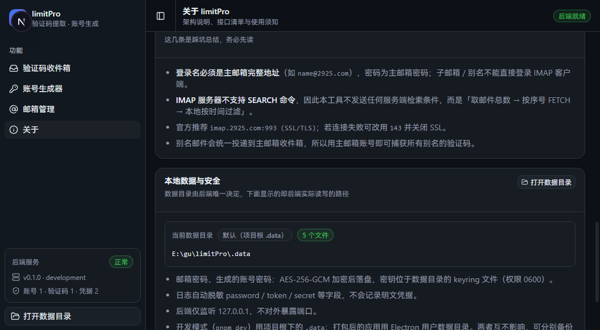
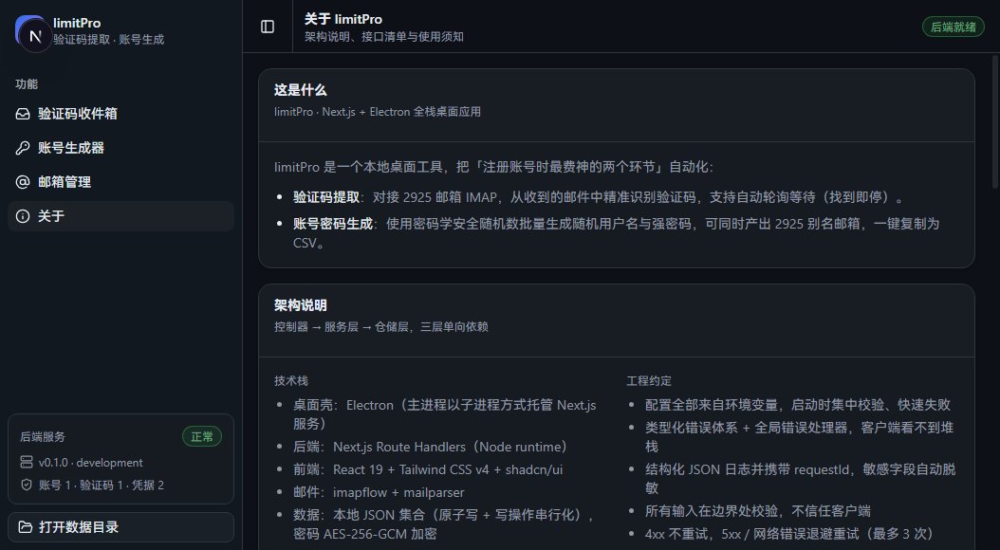

# limitPro 开发文档

面向二次开发与排障。只想使用这个工具的话，看 [README](../README.md) 就够了。

---

## 🧱 技术栈

| 层 | 选型 | 说明 |
| --- | --- | --- |
| 桌面壳 | **Electron 33** | 主进程以子进程方式托管 Next.js 服务，进程隔离 |
| 后端 | **Next.js 15 Route Handlers** | Node runtime，与前端同源，无跨域成本 |
| 前端 | **React 19** | App Router + 客户端组件 |
| UI | **Tailwind CSS v4 + shadcn/ui** | 设计令牌驱动，深色主题（GitHub Dark 配色） |
| 图标 | **lucide-react** | 与 shadcn/ui 默认图标库一致 |
| 提示 | **sonner** | shadcn 官方推荐的 Toast 方案 |
| 邮件 | **imapflow + mailparser** | 纯 Node 实现，规避 2925 的 SEARCH 限制 |
| 数据 | **本地 JSON 集合** | 原子写 + 写操作串行化，仓储层可整体替换为 SQLite |
| 包管理 | **pnpm 11** | 锁文件 + 全局 store |

---

## 🚀 开发命令

### 环境要求

- **Node.js >= 20**（推荐 22）
- **pnpm >= 10**

```bash
node -v && pnpm -v
```

### 安装与运行

```bash
pnpm install

# 开发：同时启动 Next.js(:3210) 与 Electron 窗口
pnpm dev

# 分开跑
pnpm dev:next        # 只起 Next.js 开发服务
pnpm dev:electron    # 只起 Electron（需先跑 pnpm dev:next）
pnpm dev:web         # 同 dev:next，语义化别名（浏览器调试用）
```

### 构建与打包

```bash
pnpm build          # next build + 复制静态资源到 standalone 目录
pnpm start:web      # 以生产模式在浏览器验证
pnpm start:electron # 以生产模式启动 Electron（加载 standalone server）
pnpm dist:win       # 打包 Windows 安装包（输出到 release/）
pnpm dist:mac       # 打包 macOS 安装包（dmg + zip，arm64 与 x64 各一份）★ 只能在 macOS 上执行
pnpm icons          # 由 src/app/icon.svg 重新生成 build-assets/icon.icns 与 icon.png
```

> [!IMPORTANT]
> **打包用的镜像和安装依赖用的镜像不是同一套机制。**
> `.npmrc` 里的 `electron_mirror` / `electron_builder_binaries_mirror` **只对 npm/pnpm 安装时生效**；
> electron-builder 自带的下载器（Go 写的 app-builder）**只认环境变量** `ELECTRON_MIRROR` /
> `ELECTRON_BUILDER_BINARIES_MIRROR`。若不设置，它会直连 GitHub 下载 electron 发行包与
> winCodeSign / nsis 资源 —— 在国内网络下极易被截断，而且**不校验完整性就静默使用残包**
> （详见下方「开发环境常见坑」第 6 条）。
> 这两个变量由 `scripts/pack.mjs` 在调用 electron-builder 前显式补上（已设置则不覆盖）。

> [!NOTE]
> `build.files` 里的 `!node_modules/**/*` **不要删**。electron-builder 默认会把 production
> 依赖一并打进 `resources/app.asar`（本项目实测 213MB），但本项目的服务端实际跑在
> `resources/app/.next/standalone/`（自带一份 node_modules），主进程只 require Electron
> 内置模块，asar 里那份 node_modules 纯属冗余。加上该排除后 asar 约 **10KB**。
> 附带好处：不再每次构建都写一个两百多兆的巨型文件，也就少了很多被安全软件/索引服务
> 咬住文件句柄、导致下一次构建清不掉输出目录的机会（见常见坑 9）。

`dist` / `dist:win` / `dist:mac` 的完整链路：

```
node scripts/electron-cache-guard.mjs   # 校验 electron zip 缓存，坏的就删掉
  → pnpm build                          # next build + 复制静态资源
  → node scripts/pack.mjs [--win|--mac] # 校验平台、挑一个能用的输出目录、注入镜像，再调 electron-builder
```

**为什么不是直接调 `electron-builder`** —— 见常见坑 9。`pack.mjs` 做四件事：

1. **平台校验**：`--mac` 只在 macOS 上放行（见下方「macOS 打包」），在其他系统上直接给出
   人话解释和可行路径，不让 electron-builder 抛一句英文报错；
2. **镜像注入**：补上 `ELECTRON_MIRROR` / `ELECTRON_BUILDER_BINARIES_MIRROR`（已显式设置则不覆盖），
   并清掉 `ELECTRON_RUN_AS_NODE`（否则会影响它拉起的子进程）；
3. **输出目录体检**：`release/` 能清就清；清不掉就改名为 `release.stale-<时间戳>`；
   改名也失败就落到 `release-fallback/`。**保证输出目录被占用时构建依然跑得完**；
4. **顺手清理**历史遗留的 `release.stale-*` / `release-<时间戳>` 目录。

> [!TIP]
> `.vscode/settings.json` 里用 `files.watcherExclude` / `search.exclude` 把 `release*/`、`.next/`、
> `node_modules/`、`.data/` 排除掉了。这不是性能优化，而是**降低打包失败概率**：IDE 的编辑器标签、
> 索引器打开工作区里的文件时，句柄通常不含 `FILE_SHARE_DELETE`，会让 electron-builder
> 清空输出目录那一步直接失败（常见坑 9）。

### macOS 打包

**硬约束：macOS 安装包只能在 macOS 上构建。** 不管怎么配置都绕不过去 —— dmg 制作依赖
`hdiutil`、签名依赖 `codesign`、公证依赖 `notarytool`，这三样只存在于 macOS；
electron-builder 在 Windows / Linux 上会直接拒绝（`Build for macOS is supported only on macOS`）。
`scripts/pack.mjs` 已提前拦截这个组合并打印可行路径，不会让你对着一句英文报错发愣。

三条可行路径（按「省事程度」排序）：

| 路线 | 你需要准备的 | 成本 | 适合 |
| --- | --- | --- | --- |
| 借/用一台 Mac | 任意一台 Mac（Intel / Apple Silicon 都行） | 0 | 手边正好有 Mac，或同事有 |
| GitHub Actions 云构建 | 一个 GitHub 仓库（本项目已备好 workflow） | 公开仓库免费；私有仓库 macOS runner 按 **10 倍**扣分钟（免费额度 2000 分钟/月 → 实际约 200 分钟，一次打包约 5–10 分钟） | 手上没有 Mac，想长期可重复出包 |
| 租云 Mac | 按小时计费的 macOS 云主机 | 约 ¥5–30/小时量级（各家差异大） | 偶尔出一次包，不想动 Git 仓库 |

三者的执行命令是同一条：在 Mac 上 `pnpm install && pnpm dist:mac`。
走 GitHub Actions 时推代码后在 Actions 页面下载 `limitPro-macos` 产物即可
（`.github/workflows/build-mac.yml` 已经包含「类型检查 → 打包 → 校验签名与架构 → 冒烟验证」四步）。

#### 产物

```
release/
├─ limitPro-0.1.0-arm64.dmg   # Apple Silicon（M 系列）
├─ limitPro-0.1.0-x64.dmg     # Intel
├─ limitPro-0.1.0-arm64.zip   # 免安装，直接解压拖进「应用程序」
├─ limitPro-0.1.0-x64.zip
├─ mac-arm64/limitPro.app     # arm64 的未打包产物（electron-builder 对 x64 用 mac/，不叫 mac-x64）
└─ mac/limitPro.app           # x64 的未打包产物
```

> [!NOTE]
> x64 的输出目录是 `mac/` 而不是 `mac-x64/`，写脚本按目录名匹配时要写成 `release/mac*/`。

#### 配置要点（`package.json` 的 `build.mac`）

| 键 | 值 | 为什么 |
| --- | --- | --- |
| `identity` | `"-"` | **ad-hoc 自签名**。不设的话 electron-builder 在找不到证书时是「完全跳过签名」，而**改过名的 Electron 二进制签名会失效**，Apple Silicon 上直接判「已损坏 / 无法打开」 |
| `hardenedRuntime` | `true` | 硬化运行时保持开启；配合下面的 entitlements 用，比关掉它更安全 |
| `entitlements` / `entitlementsInherit` | `build-assets/entitlements.mac.plist` | ad-hoc 签名**必须**声明 `com.apple.security.cs.disable-library-validation`：Electron 官方框架带 Apple Team ID，与 ad-hoc 签名校验不通过会启动即崩。文件里另有 JIT / 可写可执行内存等 Electron 必需项 |
| `notarize` | `false` | 没有 Apple 开发者账号，公证一定失败；显式关掉，避免以后配了 `CSC_*` 环境变量时被意外触发 |
| `target` | `dmg` + `zip`，各含 `arm64` 与 `x64` | 一次出货覆盖两种芯片 |
| `artifactName` | `${productName}-${version}-${arch}.${ext}` | **必须带 `${arch}`**，否则两个架构的 dmg 会覆盖成同一个文件名 |
| `icon` | `build-assets/icon.icns` | 由 `pnpm icons` 从 `src/app/icon.svg` 派生（脚本会回读校验 ICNS 结构） |

#### 装到 Mac 上第一次打不开怎么办

不签名的包从网络下载后会被 Gatekeeper 打上隔离标记，提示「无法验证开发者」或「已损坏」。两种解法：

```bash
# 方式一：解除隔离标记（推荐，一条命令解决）
xattr -dr com.apple.quarantine /Applications/limitPro.app

# 方式二：图形界面 —— 在「访达」里右键点 limitPro.app → 打开 → 再点一次「打开」
```

> [!TIP]
> 如果 ad-hoc 签名因为某些环境差异仍导致启动崩溃（崩溃报告里出现
> `mapping process and mapped file (non-platform) have different Team IDs`），
> 退一步把 `mac.hardenedRuntime` 改成 `false` 再打一次即可 —— 代价是关掉了硬化运行时。

### 脚本一览

| 命令 | 说明 |
| --- | --- |
| `pnpm dev` | 开发模式（Next.js + Electron 一起启动） |
| `pnpm dev:next` / `pnpm dev:web` | 只启动 Next.js 开发服务 |
| `pnpm dev:electron` | 只启动 Electron |
| `pnpm build` | 生产构建（含 standalone 静态资源复制） |
| `pnpm start:web` | 以生产模式运行 standalone 服务 |
| `pnpm start:electron` | 以生产模式启动 Electron |
| `pnpm dist:win` | 打包 Windows 安装包（输出到 `release/`，被占用时自动落 `release-fallback/`） |
| `pnpm dist:mac` | 打包 macOS 安装包（dmg + zip × arm64/x64，**只能在 macOS 上执行**） |
| `pnpm icons` | 由 `src/app/icon.svg` 生成 `build-assets/icon.icns` + `icon.png`（无头 Edge 光栅化 + 纯 Node 合成 ICNS） |
| `node scripts/electron-cache-guard.mjs` | 校验 electron 的 zip 缓存是否完整，损坏则删除（`dist*` 自动调用） |
| `node scripts/pack.mjs [--win]` | 打包入口：挑可用输出目录 + 注入镜像 + 调 electron-builder（`dist` / `dist:win` 自动调用） |
| `pnpm typecheck` | TypeScript 类型检查 |
| `pnpm test:extractor` | 验证码提取器单元测试（13 条用例，无需启动服务） |
| `pnpm smoke` | 端到端接口冒烟测试（49 项断言，需先启动后端） |
| `pnpm verify:ui` | UI 真实渲染验证（无头 Edge + CDP 真实点击，需先启动后端） |
| `pnpm verify:open-dir` | 「打开数据目录」真实效用验证（仅 Windows） |

各验证脚本默认打 `http://127.0.0.1:3210`，可指定其它地址：

```bash
LIMITPRO_SMOKE_BASE=http://127.0.0.1:3211 pnpm smoke
LIMITPRO_UI_BASE=http://127.0.0.1:3211 pnpm verify:ui
$env:LIMITPRO_BASE='http://127.0.0.1:3211'; pnpm verify:open-dir
```

> 冒烟测试会自行清理它创建的账号与生成记录，不会污染已有数据。

---

## 🧠 验证码提取算法

`src/lib/mail/codeExtractor.ts` 是一个**纯函数、零依赖**模块，采用多信号打分而非简单的「取第一个数字」：

| 信号 | 处理方式 |
| --- | --- |
| 关键字命中 | 中英文规则分级加权：`验证码`(1.0) > `verification code`(0.95) > `OTP` / `passcode`(0.9) > 通用 `code`(0.5) |
| 邻近度 | 候选码与关键字的字符距离越近得分越高；紧邻关键字额外加成 |
| 位置 | 出现在**邮件主题**中显著加分；多处重复出现加分 |
| 长度适配 | 6 位 > 5 位 > 4 位 > 7/8 位；同时支持字母数字混合码 |
| 噪声惩罚 | 年份（1900–2099）、纯重复数字、订单号 / 运单号 / 金额 / 货币符号等上下文一律降权 |
| 分隔符容错 | `123 456`、`123-456`、`123_456` 均识别为同一个 6 位验证码 |
| 兜底 | 完全无关键字时退化为「全文高频 4~8 位数字」，置信度刻意压到 ≤0.4 并标注「建议人工确认」 |

输出结构：`{ code, confidence, reason, context, length }` —— 界面上会展示置信度与判定依据，便于人工复核。

```bash
pnpm test:extractor   # 13 条用例覆盖上述全部规则
```

---

## 🏗 架构设计

### 分层：控制器 → 服务层 → 仓储层（单向依赖）

```
src/app/api/**/route.ts      控制器：解析请求 / 校验入参 / 格式化响应（不含业务逻辑）
        ↓
src/lib/services/*.ts        服务层：业务规则与编排（不依赖任何 HTTP 类型）
        ↓
src/lib/repositories/*.ts    仓储层：数据读写（原子写 + 写操作串行化）
```

### 关键决策

| 决策点 | 选择 | 理由 |
| --- | --- | --- |
| 服务形态 | Next.js 单体（Route Handlers 作后端）+ Electron 壳 | 前后端同源，无跨域与部署成本，桌面端开箱即用 |
| Electron 与 Next 的关系 | 主进程以**子进程**方式托管 Next.js 服务 | 进程隔离，Next 崩溃 / 重启不影响主进程稳定性；生产环境自动分配空闲端口 |
| 数据库 | 本地 JSON 集合（仓储层封装） | 单机小数据量；避免 `better-sqlite3` 在 Electron 下的原生模块重编译。仓储层可整体替换为 SQLite，服务层无感知 |
| 实时能力 | 前端**轮询** `/api/mail/fetch` | 语义是「等待新邮件到达」，轮询实现最简单且无长连接运维成本；命中后自动停止 |
| 认证 | 无（仅监听 `127.0.0.1`） | 纯本地桌面应用，不对外暴露端口；敏感数据加密落盘 |
| 密钥管理 | 数据目录下的 `keyring` 文件（权限 0600） | 避免把主密钥硬编码进代码库，首次运行自动生成 |
| UI 体系 | Tailwind CSS v4 + shadcn/ui | 组件源码在仓库内（非黑盒依赖），设计令牌集中管理，可完全定制 |

### 数据目录：只允许一个权威来源

历史教训 —— 主进程曾自己拼 `path.join(app.getPath('userData'), 'data')` 来响应「打开数据目录」，
而开发模式下真正读写数据的是 `next dev`（工作目录 = 项目根，数据在 `<项目根>/.data`）。
**同一件事有了两个答案**，按钮于是打开了另一个空目录。

现在的职责划分：

| 环节 | 职责 |
| --- | --- |
| `src/lib/config.ts` | 唯一真相：`LIMITPRO_DATA_DIR` → 未设置时回退 `<cwd>/.data` |
| `POST /api/system/reveal-data-dir` | 由后端解析该路径并调用系统文件管理器打开（带同源校验） |
| 前端 | 只调用接口、展示后端返回的路径，**不做任何路径拼接** |
| Electron 主进程 | 不再提供打开数据目录的 IPC；仅在打包时把 `LIMITPRO_DATA_DIR` 指向 `userData/data` |

> [!TIP]
> 想让开发模式也用固定目录（例如与打包版共用一份数据），在 `.env.local` 里设置绝对路径：
> `LIMITPRO_DATA_DIR=E:\limitPro-data`

「关于」页会把这个路径、来源与文件数直接显示出来，排障时看这一块即可：



<details>
<summary>「关于」页整体（含端点清单）</summary>



</details>

---

## 📁 目录结构

```
limitPro/
├─ electron/
│  ├─ main.js                    Electron 主进程（开发连 dev server；生产托管 standalone server）
│  └─ preload.js                 contextBridge 白名单能力
├─ .github/workflows/
│  └─ build-mac.yml              在 GitHub 的 macOS runner 上云构建 mac 安装包（见「macOS 打包」）
├─ .vscode/
│  └─ settings.json              watcher/search 排除构建产物（降低打包时输出目录被占用的概率，见常见坑 9）
├─ build-assets/                 electron-builder 的 buildResources 目录
│  ├─ icon.icns                  macOS 图标（由 pnpm icons 从 src/app/icon.svg 生成）
│  ├─ icon.png                   同一图标的 1024 PNG（备用）
│  └─ entitlements.mac.plist     ad-hoc 签名所需的权限声明（见「macOS 打包」）
├─ scripts/
│  ├─ prepare-standalone.mjs     构建后把 .next/static、public 复制进 standalone 目录
│  ├─ electron-cache-guard.mjs   打包前校验 electron zip 缓存完整性（见常见坑 6）
│  ├─ pack.mjs                   打包入口：平台校验 + 挑可用输出目录 + 注入镜像 + 调 electron-builder（见常见坑 9）
│  ├─ make-icons.mjs             由 src/app/icon.svg 生成 icon.icns / icon.png（无头 Edge 光栅化 + 纯 Node 合成 ICNS）
│  ├─ test-extractor.mjs         验证码提取器单元测试（无需测试框架）
│  ├─ smoke-test.mjs             端到端接口冒烟测试
│  ├─ ui-verify.mjs              UI 真实渲染验证（无头 Edge + CDP 真实点击）
│  └─ verify-open-dir.ps1        「打开数据目录」真实效用验证（Win32 枚举窗口，仅 Windows）
├─ docs/screenshots/             README 使用的界面截图
├─ src/
│  ├─ instrumentation.ts         服务端启动钩子：配置校验 + 启动日志
│  ├─ app/
│  │  ├─ layout.tsx              根布局：深色主题 + Tooltip/Toaster Provider
│  │  ├─ globals.css             Tailwind v4 + shadcn 设计令牌（GitHub Dark 配色）
│  │  ├─ icon.svg                应用图标（App Router 文件约定，自动生成 favicon 链接）
│  │  ├─ page.tsx                主页面：Sidebar 导航 + 四个功能视图
│  │  └─ api/                    REST 端点（health、meta、accounts、mail、codes、credentials、system）
│  ├─ components/
│  │  ├─ ui/                     shadcn/ui 组件（button、card、select、table、sidebar、sonner…）
│  │  ├─ shared.tsx              业务共享组件（SectionCard / StatusBadge / ToneAlert / CopyButton…）
│  │  ├─ CodeInbox.tsx           验证码收件箱
│  │  ├─ CredentialGenerator.tsx 账号生成器
│  │  └─ MailAccounts.tsx        邮箱管理
│  ├─ hooks/use-mobile.ts        shadcn Sidebar 依赖
│  ├─ lib/
│  │  ├─ config.ts errors.ts logger.ts validation.ts http.ts crypto.ts types.ts utils.ts notify.ts
│  │  ├─ mail/          imapClient.ts · codeExtractor.ts（核心算法）
│  │  ├─ account/       generator.ts
│  │  ├─ repositories/  jsonStore.ts · accountRepo.ts · codeRepo.ts · credentialRepo.ts
│  │  ├─ services/      accountService.ts · mailService.ts · credentialService.ts · systemService.ts（数据目录唯一来源）
│  │  └─ client/        api.ts（前端类型化客户端）
│  └─ types/global.d.ts
├─ components.json               shadcn/ui 配置
├─ postcss.config.mjs            Tailwind CSS v4 接入
├─ pnpm-workspace.yaml           pnpm 配置（allowBuilds / nodeLinker）
├─ .npmrc                        Electron 国内镜像
└─ .env.example  next.config.mjs  package.json  tsconfig.json
```

---

## 🔌 API 接口

| 方法 | 路径 | 说明 |
| --- | --- | --- |
| `GET` | `/api/health` | 健康检查（Electron 主进程据此判断后端就绪） |
| `GET` | `/api/meta` | 下发后端默认值与各项限制，避免前端硬编码 |
| `GET` | `/api/accounts` | 账号列表（不含密码） |
| `POST` | `/api/accounts` | 新增账号（默认先校验连通性，失败不入库） |
| `PATCH` | `/api/accounts/:id` | 修改账号 / 密码 |
| `DELETE` | `/api/accounts/:id` | 删除账号 |
| `POST` | `/api/accounts/:id/test` | 手动触发 IMAP 连通性检测 |
| `POST` | `/api/mail/fetch` | 拉取邮件并提取验证码（前端轮询此端点） |
| `GET` | `/api/codes` | 验证码提取历史 |
| `DELETE` | `/api/codes` | 清空提取历史（可按账号） |
| `POST` | `/api/credentials/generate` | 批量生成随机账号与密码 |
| `GET` | `/api/credentials` | 生成记录（密码解密后返回） |
| `DELETE` | `/api/credentials/:id` | 删除单条生成记录 |
| `DELETE` | `/api/credentials` | 清空生成记录 |
| `POST` | `/api/system/reveal-data-dir` | 在系统文件管理器中打开**后端真实使用的**数据目录（body 传 `{"dryRun":true}` 则只返回路径不打开） |

统一响应结构：

```jsonc
// 成功
{ "ok": true, "data": { /* ... */ }, "requestId": "..." }

// 失败
{
  "ok": false,
  "error": {
    "code": "VALIDATION_ERROR",
    "message": "输入校验未通过",
    "details": { "fields": { "email": "邮箱地址不是合法的邮箱地址" } }
  },
  "requestId": "..."
}
```

<details>
<summary><b>生成接口的调用示例</b></summary>

```bash
# 简化模式：长度与风格由后端随机（界面用的就是这种方式）
curl -X POST http://127.0.0.1:3210/api/credentials/generate \
  -H 'content-type: application/json' \
  -d '{"count":5,"randomize":true,"emailPrefix":"yourname","emailDomain":"2925.com","aliasSeparator":"_"}'

# 精确模式：显式指定长度与字符集
curl -X POST http://127.0.0.1:3210/api/credentials/generate \
  -H 'content-type: application/json' \
  -d '{"count":3,"usernameLength":12,"passwordLength":20,"style":"random","symbols":true,"digits":true,"uppercase":true,"excludeAmbiguous":true}'
```

</details>

### 「自动随机」策略明细

| 参数 | 行为 |
| --- | --- |
| 生成数量 | 默认 **1**，上限 50 |
| 主邮箱前缀 | 下拉框，选项来自「邮箱管理」已配置的邮箱；亦可选「仅生成用户名（不带邮箱）」 |
| 用户名长度 | 每次生成时在 **8~14** 区间随机 |
| 密码长度 | 每次生成时在 **14~20** 区间随机 |
| 用户名风格 | 每次在 `readable`（如 `silentharbor67`）/ `random`（如 `d9z6m4zp24b73`）中随机二选一 |
| 密码字符集 | 默认：含大写、含数字、含符号，并排除易混淆字符 `0Oo1lIi5Ss` |
| 邮箱域名 / 别名分隔符 | 从所选邮箱自动推导（`2925.com` / `_`） |

> 随机长度是**每批抽一次**：同一批内所有记录长度一致（便于成组使用），不同批次之间才变化。
> 需要精确控制时，可直接调 `POST /api/credentials/generate` 传入 `usernameLength` / `passwordLength` / `style` 等字段。

---

## ⚙️ 配置项

所有配置均来自环境变量，复制 `.env.example` 为 `.env.local` 后按需修改。
**真实的邮箱账号与密码不要写在这里**，请在应用界面「邮箱管理」中录入（会加密落盘）。

| 变量 | 默认值 | 说明 |
| --- | --- | --- |
| `LIMITPRO_DATA_DIR` | `<项目根>/.data` | 数据目录（账号、验证码历史、密钥环） |
| `LIMITPRO_LOG_LEVEL` | `info` | 日志级别：`debug` / `info` / `warn` / `error` |
| `PORT` / `HOSTNAME` | `3210` / `127.0.0.1` | Next.js 服务监听配置（Electron 生产模式自动分配空闲端口） |
| `LIMITPRO_IMAP_HOST` | `imap.2925.com` | IMAP 服务器 |
| `LIMITPRO_IMAP_PORT` | `993` | IMAP 端口 |
| `LIMITPRO_IMAP_SECURE` | `true` | `true` = SSL/TLS；连接失败可改 `false` + `143`（明文） |
| `LIMITPRO_IMAP_DISABLE_SEARCH` | `true` | 2925 不支持 SEARCH，必须按序号 FETCH 后本地过滤 |
| `LIMITPRO_IMAP_TIMEOUT_MS` | `20000` | 连接 / 指令超时（毫秒） |
| `LIMITPRO_IMAP_ALLOW_INVALID_CERT` | `false` | 跳过 TLS 证书校验（仅证书链不完整时使用，不推荐） |
| `LIMITPRO_MAIL_FETCH_LIMIT` | `30` | 默认拉取的最大邮件条数 |

### 数据与安全

| 项目 | 说明 |
| --- | --- |
| 数据目录 | **由后端唯一决定**（`config.dataDir`）：开发模式 `<项目根>/.data`；打包后 Electron `userData/data` |
| 落盘文件 | `accounts.json`、`codes.json`、`credentials.json`、`keyring` |
| 加密方式 | 邮箱密码与生成密码均为 **AES-256-GCM** 密文；主密钥保存在 `keyring`（权限 0600） |
| 日志脱敏 | `password` / `token` / `secret` 等字段自动脱敏，不记录明文凭据 |
| 网络暴露 | 后端仅监听 `127.0.0.1`，不对外暴露端口；打开数据目录的接口带同源校验 |
| 前端存储 | 令牌与密码不写入 `localStorage`，不放入 URL 查询参数 |

> [!IMPORTANT]
> 删除 `keyring` 会导致已保存的密文**无法解密**，请连同数据目录一起备份。

---

## 🧪 为什么需要这两个特殊验证脚本

`pnpm typecheck` 与 `pnpm build` 通过，**不等于功能真的能用**。下面两类失败它们都查不出来。

### `pnpm verify:open-dir`

`typecheck`、`build`、`smoke` **全部无法发现**「打开数据目录」失效 —— 因为
`spawn('explorer.exe', …)` 只要进程被创建就返回成功，而 `explorer.exe` 即使窗口没显示
也返回成功退出码。历史上就因此出过「点了按钮只弹提示、目录根本没打开」的假阳性。

脚本用 Win32 `EnumWindows` **真实枚举桌面上的文件夹窗口**（`CabinetWClass`），
以「窗口是否真的出现」为唯一判据。实现要点（都踩过坑）：

1. **不能用窗口标题判定** —— 用户可能本来就开着同名目录的窗口，会误判。要用 COM 拿窗口的
   **真实路径**（`Document.Folder.Self.Path`）。
2. **关窗口要用 COM 的 `.Quit()`，不要用 `WM_CLOSE`** —— 后者会在系统里留下
   `IsWindowVisible=false` 的隐藏僵尸窗口（COM 列得出来、`EnumWindows` 看不见），越跑越多。
3. 兼容「资源管理器复用已开窗口、只提到前台」的行为（这种情况不会新建窗口）。
4. 先自检探针可信度（确认能枚举到任务栏），避免把「探针瞎了」当成「功能坏了」。

脚本运行时会短暂弹出数据目录窗口，验证完自动关闭（只关它自己打开的那个）。

### `pnpm verify:ui`

水合失败、事件处理器没挂上、下拉框默认值不在选项里、文字被 grid 布局拆行……
这些只在真实渲染中暴露，编译检查一律查不出。脚本用无头 Edge 通过 CDP 真实点击驱动，
核心断言是**「关于」页显示的数据目录 == `/api/health` 报告的 `dataDir`** ——
锁死本项目曾出现过的「打开数据目录打开了另一个空目录」这类问题。

两条实现上的硬要求：

1. **必须等 React 水合完成再点击**（判据：DOM 节点上出现 `__reactFiber$`）。
   SSR 的 HTML 在 hydration 之前就已包含业务文案，若只等「页面出现某段文字」就点，
   点击会落在尚未挂载处理器的节点上，表现为「点了没反应」的**假故障**。
2. **错误覆盖层不能只看 `nextjs-portal`**（它是 Next 开发模式的常驻容器），
   要查它 shadowRoot 里的 `#nextjs__container_errors_label`；
   并且必须在 `Page.navigate` **之前**开启 Runtime/Log 监听，否则抓不到加载期的报错。

---

## 🐛 开发环境常见坑

### 1. 第二个 `next dev` 实例卡在 `✓ Starting...`，或所有路径突然 500

两个 `next dev` 只要**工作目录相同**，就共用同一个 `.next` 目录并互相抢锁。后启动的实例永远不输出
`Ready`，并可能把正在服务的实例的 dev 缓存写坏 —— 表现为**所有路径（含 `/api/health`）返回纯文本
`Internal Server Error`**，连错误详情页都渲染不出来。

处理：**同一项目只保留一个 dev 实例**。已经出问题时：

```powershell
# 1) 停掉占用端口的进程
Get-NetTCPConnection -LocalPort 3210 -State Listen | ForEach-Object { Stop-Process -Id $_.OwningProcess -Force }
# 2) 隔离被写坏的缓存（重命名比直接删除更安全，确认无误后再删）
Rename-Item .next .next.broken
# 3) 重新启动
pnpm dev
```

> 同理，`pnpm build` 会清理 `.next`，**必须先停掉在跑的 `pnpm dev`**，否则会把它的缓存写坏。

### 2. `Module build failed: UnhandledSchemeError: Reading from "node:fs" is not handled by plugins`

**现象**：`pnpm dev` 后页面直接 500，服务端日志里是：

```
⨯ node:fs
Module build failed: UnhandledSchemeError: Reading from "node:fs" is not handled by plugins
Import trace for requested module:
node:fs
./src/lib/config.ts
 ○ Compiling /instrumentation ...
```

**原因**：Next.js 会把 `src/instrumentation.ts` **同时**编译进 `nodejs` 与 `edge` 两个运行时
（即使项目里根本没有 middleware），而 edge 运行时不存在 `node:fs`；`await import('./lib/config')`
一旦在 edge 编译里被解析到，就会把整条链拉进 `node:fs` 并直接 fail。

**关键点：守卫必须写成 `if` 块，不能写成「提前 return」** —— webpack 是逐语句静态解析的，
函数体后面的语句照样会被解析、照样进 edge 编译图：

```ts
// ❌ 无效：仍然会报 UnhandledSchemeError
if (process.env.NEXT_RUNTIME !== 'nodejs') return;
const { config, validateConfig } = await import('./lib/config');

// ✅ 正确：edge 编译时条件被常量折叠为 false，整个块被剔除
if (process.env.NEXT_RUNTIME === 'nodejs') {
  const { config, validateConfig } = await import('./lib/config');
}
```

**通用规则**：任何 Node 专有依赖（`node:fs` / `node:path` / `node:crypto`）都不得从
「会被 edge 编译的文件」顶层可达。本项目的 API 路由均已显式声明 `export const runtime = 'nodejs'`。

### 3. `⚠ Attempted to load @next/swc-win32-x64-msvc, but an error occurred`

Windows 下 SWC 原生二进制加载失败（`A dynamic link library (DLL) initialization routine failed`），
常见原因是缺少 Microsoft Visual C++ 运行库或被安全软件拦截。Next 会自动回退到 WASM 版本 ——
**功能不受影响，只是 dev 编译更慢**。需要恢复原生加速时，安装 VC++ Redistributable 后重装依赖即可。

### 4. 「打开数据目录」只有提示、文件夹没弹出来

**原因**（已修复，记录于此以防回归）：`spawn('explorer.exe', [dir])` 带了 `windowsHide: true`。
这个参数在 Windows 上会以 `CREATE_NO_WINDOW` 标志创建子进程，**导致 explorer 的文件夹窗口完全不显示**；
而 `spawn` 事件照样触发、接口照样返回 `opened: true`，于是表现为「有提示、没窗口」的假阳性。

实测对照（6 组，用 `EnumWindows` 枚举 `CabinetWClass` 判定）：

| 启动方式 | 窗口是否出现 |
| --- | --- |
| `explorer.exe` + `detached` + **`windowsHide: true`** | ❌ 无窗口 |
| PowerShell `Start-Process` + **`windowsHide: true`** | ❌ 无窗口 |
| `rundll32` + **`windowsHide: true`** | ❌ 无窗口 |
| `explorer.exe` + `detached` | ✅ 出现 |
| `explorer.exe` 朴素调用 | ✅ 出现 |
| `cmd /c start "" <dir>` | ✅ 出现 |

结论：只要带 `windowsHide: true` 就静默失败，不带就正常。因此
`src/lib/services/systemService.ts` 的 `openInFileManager()` **刻意不传该参数**
（`detached: true` 仍然保留，让文件管理器独立于后端进程存活）。

> [!NOTE]
> `electron/main.js` 生产模式启动 standalone server 时确实用了 `windowsHide: true`，
> 那里是**正确的**（它就是不想给 Node 控制台程序弹黑窗）。已验证该标志**不会**被孙进程继承 ——
> server 拉起的 explorer 窗口照常显示。

### 5. 2925 的 IMAP 不支持 SEARCH

⚠️ 2925 的 IMAP 服务**不实现 SEARCH 命令**。本项目因此**不发送任何服务端检索条件**，
而是「`SELECT` 取邮件总数 → 按序号区间 `FETCH` 末尾 N 封 → 本地按时间过滤」。
这就是 `src/lib/mail/imapClient.ts` 存在的意义。

另外两点：

- **子邮箱 / 别名不能直接登录 IMAP 客户端**，只能用主邮箱登录（别名邮件统一投递到主邮箱收件箱）。
- **端口 / 加密方式需要实测**：既有 `993 + SSL` 可用的环境，也有只能走 `143` 明文的环境。
  若出现 `Unexpected close` / `read ECONNRESET`，切换另一种组合重试。

### 6. 打包报 `ENOENT: no such file or directory, rename '...\win-unpacked\electron.exe' → '...\limitPro.exe'`

**症状**：`pnpm dist:win` 中途失败，报错指向 `release\win-unpacked\electron.exe` 不存在：

```
ENOENT: no such file or directory, rename
  'E:\gu\limitPro\release\win-unpacked\electron.exe'
  -> 'E:\gu\limitPro\release\win-unpacked\limitPro.exe'
```

**这个报错极具误导性** —— 它指向 `win-unpacked`，让人以为是权限、文件被占用或旧构建残留，
实际根因在**下载缓存**：

1. electron-builder 的下载器把 electron 发行包缓存在
   `%LOCALAPPDATA%\electron\Cache\electron-v<版本>-win32-x64.zip`；
2. 国内直连 GitHub 下载时这个 zip 被**截断**（实测下到 105.1MB，完整应约 109.7MB）；
3. 下载器**不校验完整性**，直接把残包解压 —— 于是 `electron.exe`、`d3dcompiler_47.dll`、
   `libEGL.dll` 等根本没被解出来（`win-unpacked` 里只有 `locales`、`ffmpeg.dll`、`icudtl.dat`
   这类排在压缩包前面的条目）；
4. 最后一步「把 `electron.exe` 重命名为 `<productName>.exe`」找不到源文件，抛出 ENOENT。

先确认是不是这个问题（看缓存文件大小与时间戳即可，坏包通常明显偏小且时间戳就是失败那次构建）：

```powershell
Get-ChildItem "$env:LOCALAPPDATA\electron\Cache" -Recurse -File |
  Select-Object FullName, @{n='MB';e={[math]::Round($_.Length/1MB,1)}}, LastWriteTime |
  Sort-Object LastWriteTime -Descending
```

**修复**：删掉坏缓存，并让下载走国内镜像。这两步现在都已内置：

- `scripts/electron-cache-guard.mjs` 在 `dist` / `dist:win` 开始时自动体检（用 ZIP 的 EOCD
  记录判断完整性），坏的就删除并打印明确原因，例如
  `中央目录越界（偏移 109.7MB + 大小 0.0MB > 文件 105.1MB）`；
- 打包脚本用 `cross-env` 注入 `ELECTRON_MIRROR`，让下载器改走 npmmirror。

想手动重来：

```powershell
node scripts/electron-cache-guard.mjs   # 体检 + 清理坏缓存
pnpm dist:win                           # 重新下载并打包
```

> [!NOTE]
> `winCodeSign` / `nsis` 等构建资源同样从 GitHub 下载，也有相同的截断风险，
> 所以打包脚本里一并设置了 `ELECTRON_BUILDER_BINARIES_MIRROR`。

### 7. 打包报 `Cannot create symbolic link : 客户端没有所需的特权`（winCodeSign 解压失败）

**症状**：`pnpm dist:win` 走到 `packaging` 之后失败，日志里是 7za 解压 `winCodeSign-2.6.0.7z`
时报错、electron-builder 连重试 4 次后放弃：

```
downloading  url=.../winCodeSign-2.6.0/winCodeSign-2.6.0.7z
⨯ cannot execute  cause=exit status 2
   errorOut=ERROR: Cannot create symbolic link : 客户端没有所需的特权。 :
     ...\winCodeSign\979969539\darwin\10.12\lib\libcrypto.dylib
   command='...\7za.exe' x -snld -bd '<cache>\winCodeSign\979969539.7z' '-o<...>'
```

**原因**：`winCodeSign` 包里含 macOS 的符号链接，而 Windows 普通用户默认**没有创建符号链接的特权**
（需要管理员，或开启「开发人员模式」）。7-Zip 于是以退出码 2 结束 → electron-builder 判为失败。
注意这个包只用于取 `rcedit-x64.exe`（把图标/版本写进 exe）与 `signtool.exe`（签名），
**Windows 侧文件其实已经解出来了**，只是整体被判定为失败、没落到正式缓存目录。

**两种修法（任选其一）**

**A. 开启开发人员模式**（一劳永逸，推荐）—— 设置 → 隐私和安全性 → 开发者选项 → 打开「开发人员模式」。
或者管理员 PowerShell 一行：

```powershell
New-ItemProperty -Path 'HKLM:\SOFTWARE\Microsoft\Windows\CurrentVersion\AppModelUnlock' `
  -Name AllowDevelopmentWithoutDevLicense -Value 1 -PropertyType DWord -Force
```

**B. 手动补缓存**（不改系统设置）—— 先随便让 electron-builder 失败一次（为的是把 `.7z` 下下来），
再手动解到正式目录：

```powershell
$cache = "$env:LOCALAPPDATA\electron-builder\Cache\winCodeSign"
$sz    = 'node_modules\7zip-bin\win\x64\7za.exe'
Get-ChildItem $cache -Filter *.7z | Select-Object -First 1 | ForEach-Object {
  & $sz x $_.FullName -o"$cache\winCodeSign-2.6.0" -y     # 退出码 2 是预期的
}
Test-Path "$cache\winCodeSign-2.6.0\rcedit-x64.exe"       # 应为 True
```

之后 `pnpm dist:win` 会直接复用这份缓存。缓存目录里那些随机数字命名的目录/`.7z` 是失败残留，可以删掉。

### 8. 打包后的应用双击没反应 / 一启动就退出，退出码 0

先确认环境里没有 `ELECTRON_RUN_AS_NODE`：

```powershell
$env:ELECTRON_RUN_AS_NODE    # 期望为空
```

该变量一旦存在（值为 `1`），Electron 会**退化成纯 Node**：不创建窗口、不加载 asar；
无参数启动时读 stdin 后立刻退出，退出码恰好是 **0** —— 表现得像「打包产物坏了」，其实是环境问题。
用 Node 的 `spawn` 拉 GUI 程序做验证时特别容易踩到，因为子进程会继承它：

```js
const env = { ...process.env };
delete env.ELECTRON_RUN_AS_NODE;
spawn(exe, [], { env, stdio: ['ignore', 'pipe', 'pipe'] });  // 不要加 windowsHide
```

（顺带：Windows 上 GUI 子系统程序的 stdout 抓不到，用 `>` 重定向与
`Start-Process -RedirectStandardOutput` 都无效，必须用 Node 的 `spawn` 显式挂管道。）

正常启动时主进程会打印：

```
[next]    - Local:        http://127.0.0.1:50047
[next] {"msg":"limitPro 后端已启动","dataDir":"...\\AppData\\Roaming\\limitpro\\data", ...}
[limitPro] 后端已就绪: http://127.0.0.1:50047
```

再请求 `http://127.0.0.1:<port>/api/health` 应得到 `"status":"ok"`，请求 `/` 应得到带
`<title>limitPro · 验证码提取与账号生成</title>` 的页面 —— **这才是「打包产物可用」的判据**。
构建退出码为 0 只说明构建过程没报错，不代表装出来的东西能跑。

### 9. 打包报 `remove ...\release\win-unpacked\resources\app.asar: The process cannot access the file because it is being used by another process`

**症状**：electron 包已经没问题了（不再报条款 6 的 ENOENT rename），但在 `packaging` 之前的清目录
阶段失败，紧接着一句 `app-builder.exe process failed  ERR_ELECTRON_BUILDER_CANNOT_EXECUTE`。

**原因**：electron-builder 每次构建前都会先清空 `directories.output`（`EnsureEmptyDir`）。
只要目录里**有任何一个**文件被别的进程以**不含 `FILE_SHARE_DELETE`** 的方式打开着，这步就整个失败。
本项目实测的持有者是 **IDE / 编辑器进程**（VS Code、WorkBuddy 等 Electron 应用会持有工作区里的
`resources/app.asar`）——用 Sysinternals `handle64.exe` 一眼就能看到：

```bash
handle64.exe -nobanner -accepteula -a "E:\gu\limitPro\release\win-unpacked\resources\app.asar"
# Code.exe          pid: 2464   type: File   15A8: ...\release\win-unpacked\resources\app.asar
# WorkBuddy.exe     pid: 19172  type: File    780: ...\release\win-unpacked\resources\app.asar
```

**这里有个反直觉的点，别照搬教科书**：

- ❌ *「改不掉名字，是因为有人开着资源管理器窗口」* —— 项目名带 `limitPro` 的窗口其实很少见。
  实测把资源管理器的目录句柄关掉没用（它会立刻重新拿一个）。
- ❌ *「用 `handle64 -c <hex> -p <pid>` 强关句柄」* —— 对这类句柄无效，
  执行后句柄号原样还在，文件依然 `EBUSY`。
- ❌ *「删不掉就改名让路」* —— **被独占打开的文件会连它所在的目录一起锁住改名**，
  实测 `fs.renameSync('release', ...)` 直接 `EPERM`。所以这招在这里同样不成立。
- ❌ *「一定是 Windows 搜索索引 / Defender」* —— 实测杀掉 `SearchProtocolHost` / `SearchFilterHost`、
  确认 Defender 未运行，占用依旧。
- ✅ 唯一有效的是**让持有它的程序退出**（关掉 IDE 相关窗口/重启该应用）。
  并且这**不是「asar 一律会被盯上」**：实测在项目里新建一个 `app.asar` 放 10 秒，
  没有任何进程去打开它 —— 所以新输出目录里的 asar 不会被自动咬住。

**处理**：

1. **通常不用管。** `scripts/pack.mjs` 会自动体检输出目录：清不掉 → 改名 → 改名也失败就落到
   `release-fallback/`。构建照样跑完，安装包照样产出。构建日志里会有明确提示。
2. **想恢复成输出到 `release/`**：退出占用它的程序（一般是 IDE / 编辑器），
   删掉 `release/`，再打包一次即可 —— 之后会自动回到 `release/`。
3. `.vscode/settings.json` 里已经用 `files.watcherExclude` / `search.exclude` 排除了
   `release*/`、`.next/`、`node_modules/`、`.data/`，能从源头减少这类占用。
4. 排查时临时换个输出目录（注意是**双横线**，`-c.xxx=yyy` 会被当成配置文件路径）：

   ```bash
   pnpm exec electron-builder --win --config.directories.output=_tmp_dist-verify
   ```

> [!TIP]
> `release/` 与 `release-fallback/` 都只是构建产物（已在 `.gitignore`），删掉没有任何损失。
> 顺带一提：在加上 `build.files` 里的 `!node_modules/**/*` 之前，`app.asar` 有两百多兆，
> 被安全软件/索引服务咬住的概率明显更高；现在只有 10KB，这个问题基本消失了。

### 10. 想打 macOS 包，但手上是 Windows

**症状**：`pnpm dist:mac` 在 Windows 上跑，报
`Build for macOS is supported only on macOS`；或者自己拼配置折腾很久，最后发现
`app-builder` 找不到 `hdiutil`。

**原因**：不是配置问题，是 Apple 的工具链限制 —— dmg 制作 / 签名 / 公证分别依赖
`hdiutil`、`codesign`、`notarytool`，只存在于 macOS。electron-builder 官方支持的组合里，
**Windows 主机不能构建 macOS 目标**（反过来 macOS 主机三种目标全能构建）。

**处理**：见上文「**macOS 打包**」一节 —— 三条可行路径（Mac 本机 / GitHub Actions 云构建 /
租云 Mac）与产物、配置要点、Gatekeeper 首次打开的处理办法都写在那里。
`scripts/pack.mjs` 已经会提前拦下这个组合并直接打印这三条路径，不会让你对着英文报错猜。

---

## 🗺 后续可扩展方向

- [ ] 仓储层替换为 SQLite（服务层无感知，仅需重写 `src/lib/repositories/*`）
- [ ] 增加 POP3 / 通用 IMAP（非 2925）邮箱适配器
- [ ] 验证码提取规则做成可配置词库，支持用户自定义关键字权重
- [ ] 导出到 CSV 文件 / 系统剪贴板历史
- [ ] 深色 / 浅色主题切换（设计令牌已就绪，只需放开 `next-themes` 开关）
- [ ] 打包签名与自动更新（electron-updater）
